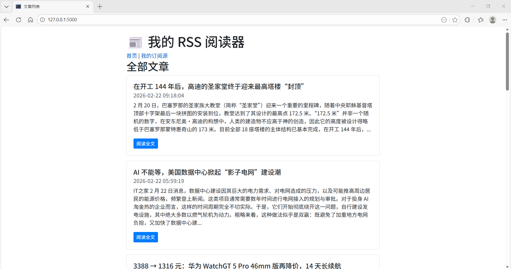
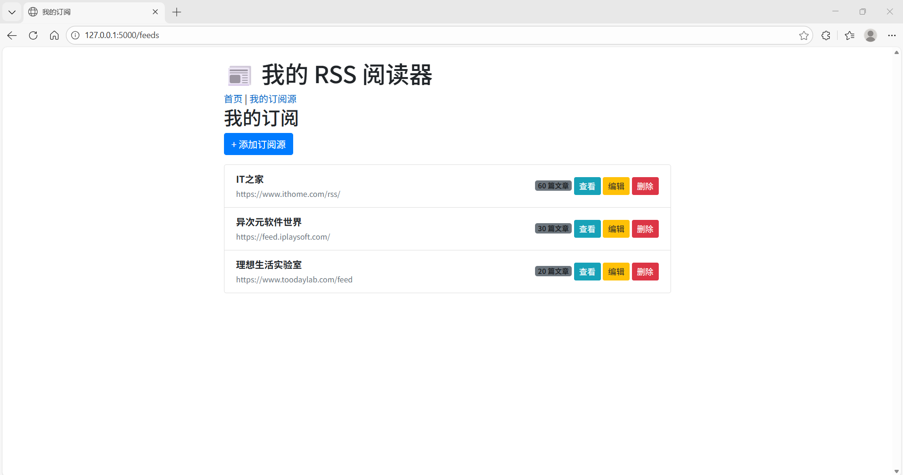

# 📰 我的RSS阅读器

一个基于 Flask 的简易 RSS 阅读器，支持订阅源管理、定时抓取、文章列表展示、按源筛选等功能。

## ✨ 功能特点

- **订阅源管理**：添加、编辑、删除 RSS 订阅源
- **自动抓取**：定时抓取所有订阅源的最新文章（每小时）
- **文章展示**：卡片式布局，支持分页，标题/摘要/来源/时间清晰可见
- **按源筛选**：点击“查看”按钮，只看某个订阅源的文章
- **响应式设计**：支持手机、平板、桌面端浏览

## 🛠️ 技术栈

- **后端**：Python 3.9+, Flask, SQLAlchemy, APScheduler
- **前端**：HTML5, CSS3, Bootstrap 5
- **数据库**：SQLite（开发），可轻松切换至 MySQL/PostgreSQL
- **工具**：feedparser（解析 RSS）
  
## 📸 界面预览




## 🚀 快速开始

### 环境要求
- Python 3.9 或更高版本
- pip 包管理器

### 安装步骤

1. **克隆仓库**
   ```bash
   git clone https://github.com/EEEEntelecheia/my-rss-reader.git
   
2. **创建虚拟环境并激活**
   ```bash
   cd my-rss-reader
   python -m venv venv
   # Windows
   venv\Scripts\activate
   # macOS/Linux
   source venv/bin/activate

3. **安装依赖**
   ```bash
   pip install -r requirements.txt
   
4. **运行应用**
   ```bash
   python run.py

## 🔮 未来计划
- 支持全文搜索
- OPML 导入/导出
- 暗色模式

## 🤝 贡献
欢迎提交 Issue 或 Pull Request。
